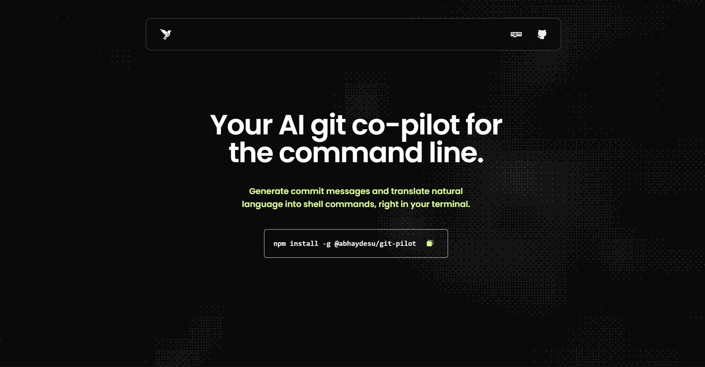

#  Git-Pilot Landing Page
This is the official landing page for Git-Pilot, the AI co-pilot for your command line. The site is designed to be a modern, responsive, and engaging introduction to the tool.

Live Site: gitpilotcli.vercel.app 

## ◾ Preview



## ◾ Features
- Fully Responsive Design: Looks great on all devices, from mobile phones to desktops.  
- Interactive Background: A dynamic and interactive background built with Three.js that reacts to user clicks.  
- Smooth Animations: Subtle transitions and animations, like the icon cross-fade on the "copy" button, enhance the user experience.  
- Optimized for Performance: Built with Next.js for fast page loads and a smooth user experience.  

## ◾ Tech Stack
This project is built with a modern, type-safe stack:

- Framework: Next.js  
- Language: TypeScript  
- Styling: Tailwind CSS  
- 3D Graphics: Three.js  

## ◾ Getting Started
Follow these instructions to get a copy of the project up and running on your local machine for development and testing purposes.

### ▪️ Prerequisites
Make sure you have Node.js (version 18.x or later) and a package manager (npm, yarn, or pnpm) installed on your system.

### ▪️ Installation
Clone the repository:

```bash
git clone https://github.com/abhaydesu/git-pilot-website.git
cd git-pilot-website
```

Install dependencies:

```bash
npm install
# or
# yarn install
# or
# pnpm install
```

Run the development server:

```bash
npm run dev
# or
# yarn dev
# or
# pnpm dev
```
Open http://localhost:3000 with your browser to see the result.

### ◾ Deployment
This application is optimized for deployment on Vercel, the platform from the creators of Next.js. You can deploy your own version with a single click using the button at the top of this README.

### ◾ License
This project is licensed under the MIT License - see the LICENSE.md file for details.

yaml
Copy code

---
